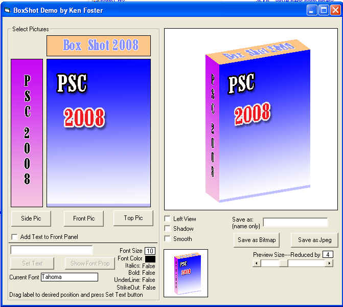



## BoxShot \(update \#3\)

### Description

This is my poor attempt at a boxshot program. My hopes are that someone will see just how poor it is and create a better looking one. Maybe even have features like shadow, reflection and rotate. Who knows.Code is real simple.Update: added left and right view and a smooth filter.

Update#2:Added shadow,preview,save as jpeg and add labels to front picture.

Update#3: Made some small changes just for Robert.Hopefully there are no bugs.
 
### More Info
 

             |
---                |---
**Submitted On**   |2008-06-28 12:27:40
**By**             |[Kenneth Foster](https://github.com/Planet-Source-Code/PSCIndex/blob/master/ByAuthor/kenneth-foster.md)
**Level**          |Beginner
**User Rating**    |5.0 (75 globes from 15 users)
**Compatibility**  |VB 6\.0
**Category**       |[Graphics](https://github.com/Planet-Source-Code/PSCIndex/blob/master/ByCategory/graphics__1-46.md)
**World**          |[Visual Basic](https://github.com/Planet-Source-Code/PSCIndex/blob/master/ByWorld/visual-basic.md)
**Archive File**   |[BoxShot\_\(u2118726282008\.zip](https://github.com/Planet-Source-Code/kenneth-foster-boxshot-update-3__1-70644/archive/master.zip)

